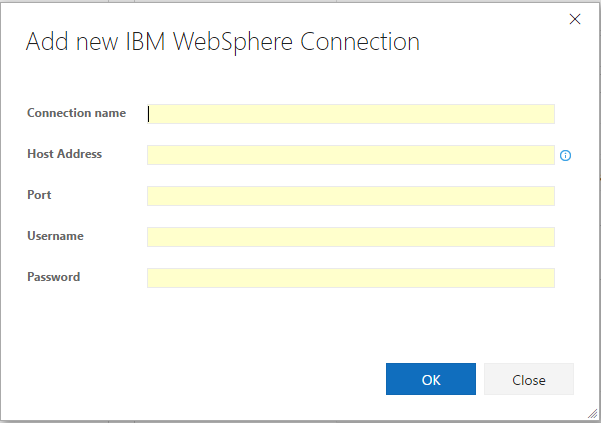

<table style="width: 100%; border-style: none;"><tr>
<td width="140px" style="text-align: center;"></td>
<td><strong>Azure DevOps Extension for IBM WebSphere Application Server</strong> 
<i>Provides deployment task that automatically installs/updates enterprise applications in WebSphere Application Servers.</i> 
<a href="https://marketplace.visualstudio.com/items/ms-vsts.ibm-websphere">Install now!</a>
</td>
</tr></table>

# Azure DevOps Extension for IBM WebSphere Application Server

This extension contains a deployment task which allows you to automate the installation and update of applications to IBM WebSphere Application Servers. This extension installs the following components:
* A service endpoint for connecting to IBM WebSphere Application Server on Azure DevOps and Team Foundation Server 2017.
* A build task to install / update enterprise applications on WebSphere Application Servers.

## Prerequisites

* In order to automate the installation and update of enterprise applications to WebSphere Application Servers, the build agent must have access to the 'wsadmin' commands. Please follow the IBM WebSphere document to setup the command environment.
To check if the environment is setup correctly:
  * You can run wsadmin.sh(Linux) / wsadmin.bat(Windows) command from the terminal or command line respectively. Make sure IBM WebSphere _bin/_ directory is in the PATH.
  * Execute "wsadmin.sh -conntype SOAP -host <your_websphere_hostname> -port <your_websphere_SOAP_port> -username <your_username> -password <your_password> -c AdminControl.getNode\(\)"
  on the build agent. It should return the node name of the IBM WebSphere Application Server.
  * You may need to create a profile in your build agent to make the command line work.

## Quick Start

Once you have set up the WebSphere environment, perform the following steps to automate the deployment of applications to WebSphere Application Servers:

1. Install the [IBM WebSphere extension](https://marketplace.visualstudio.com/items/ms-vsts.ibm-webshepere) from the Team Services Marketplace.

2. Go to your Azure DevOps or TFS project, click on the **Build** tab, and create a new build definition (the "+" icon) that is hooked up to your project's appropriate source repository.

3. Click **Add build step...** and select the necessary tasks to generate your release assets (e.g. **Maven**, **Gradle**).

4. Click **Add build step...** and select **IBM WebSphere Deployment** task from the **Deploy** category.

5. Configure the **IBM Websphere Deployment** task with the desired authentication method, and the install / update options.

6. Click the **Queue Build** button or push a change to your configured repository in order to run the newly defined build.

7. Your Websphere application changes will now be automatically installed / updated to the WebSphere Application Servers!

## IBM WebSphere Application Deployment Task

1. Open your build definition and add the "IBM WebSphere Deployment" task.  The task can be found in the 'Deploy' section.

    

1. Details of the install / update deployment task. Note that this task includes both install and update cases. If the target application does not exist,
it will install it; Otherwise it will update the target application.

    

    * Setup [Connection Options](#setup-connection-options).
    * Enter the application name.
    * Enter the update content path. This should be the path points to the application file. Wildcards can be used, but the pattern must resolve to exactly one file.
    * By default "Install Application If Not Exist" is checked. If the application does not exist, it will be first installed.
    * Enter the target cell, node, and application server name if this application is expected to be installed for the first time.
    * Enter the optional context root information. If left blank, the default context root will be _"/your_application_name"_.
    * Enter the optional Web Module, Virtual Host, and URI information. If left blank, the task will attempt to extract this information automatically from the application file.
    * By default "Start Application" is checked. It will start the application after the installation.

1. If you are certain that the target application already exists in the IBM WebSphere Application Server, you can uncheck the "Install Application If Not Exist". The task will then hide fields that are only relevant to installation:

    

### Setup Connection Options

The tasks provide two options to connect to IBM WebSphere Application Server:

1. Connecting with an "IBM WebSphere" endpoint.
    * This option is supported on Azure DevOps and Team Foundation Server 2017.  On Team Foundation Server 2015, please use other options to connect.

    

    * __Connection name__: name used to identify this connection.
    * __Hostname / IP Address__: IP address or the hostname of the computer on which the IBM WebSphere is running. The hostname must be resolvable by the build agent. Do not prefix with protocol names.
    * __Port__: SOAP port of the target WebSphere.
    * __Username and Password__: Administrative user name and password of the target WebSphere. Make you can use this pair to login the WebSphere console.

1. Manually enter credentials.
    * The same fields from "IBM WebSphere" endpoint section are repeated within the task.

## Support
Support for this extension is provided on our [GitHub Issue Tracker](https://github.com/microsoft/vsts-ibm-websphere-extension/issues).  You
can submit a [bug report](https://github.com/microsoft/vsts-ibm-websphere-extension/issues/new), a [feature request](https://github.com/microsoft/vsts-ibm-websphere-extension/issues/new)
or participate in [discussions](https://github.com/microsoft/vsts-ibm-websphere-extension/issues).

## Contributing to the Extension
See the [developer documentation](CONTRIBUTING.md) for details on how to contribute to this extension.

## Code of Conduct
This project has adopted the [Microsoft Open Source Code of Conduct](https://opensource.microsoft.com/codeofconduct/). For more information see the [Code of Conduct FAQ](https://opensource.microsoft.com/codeofconduct/faq/) or contact [opencode@microsoft.com](mailto:opencode@microsoft.com) with any additional questions or comments.

## Privacy Statement
The [Microsoft Visual Studio Product Family Privacy Statement](http://go.microsoft.com/fwlink/?LinkId=528096&clcid=0x409)
describes the privacy statement of this software.
